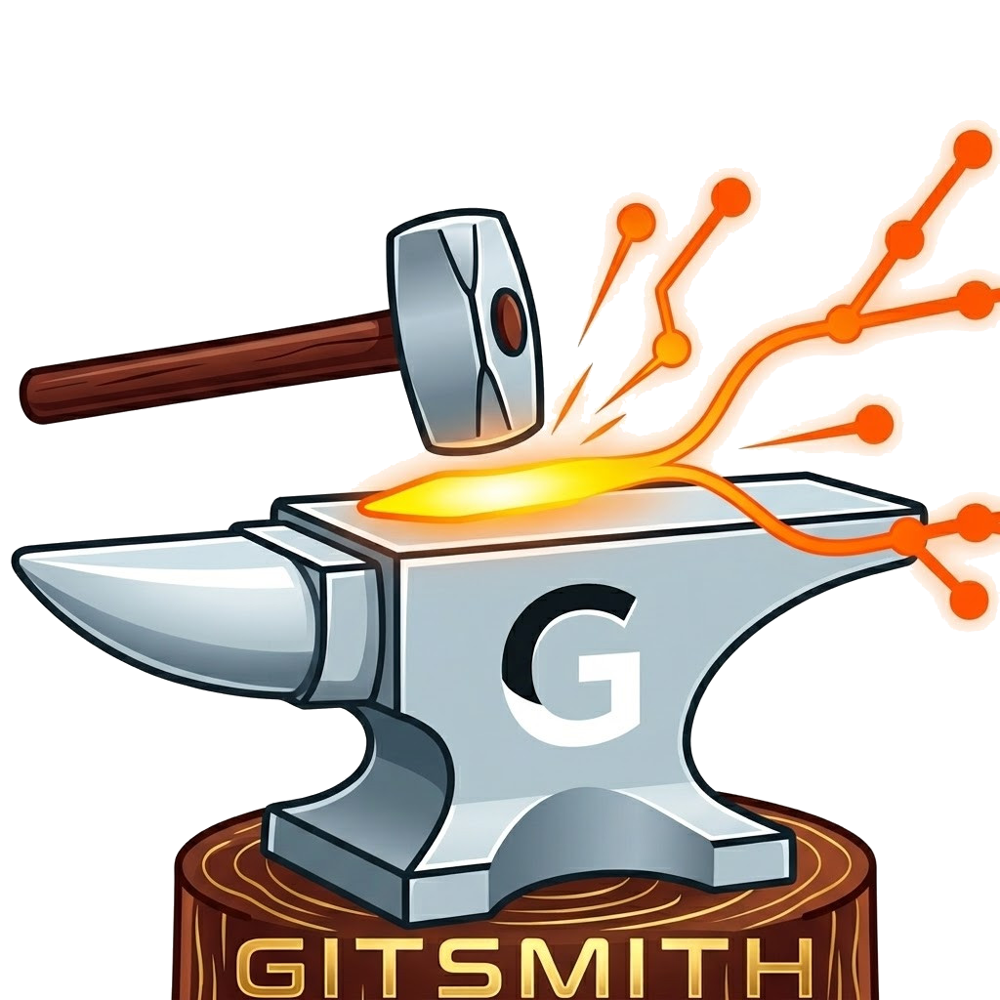

# GitSmith

[](https://github.com/Schengatto/git-expansion/actions/workflows/ci.yml)
[](LICENSE)
[](CONTRIBUTING.md)

Cross-platform Git GUI inspired by [GitExtensions](https://gitextensions.github.io/), built with **Electron**, **React**, and **TypeScript**.

<p align="center">
  
</p>

## Features

### Core
- **Commit graph** with colored lane lines, virtualized scrolling, branch/tag decorations
- **Staging panel** with file-level and line-level (hunk) staging
- **Diff viewer** with unified and side-by-side modes (powered by diff2html)
- **Commit dialog** with amend support and discard changes
- **Command log** showing every git command executed

### Branch Management
- Create, rename, delete branches
- Merge and rebase (standard + interactive rebase with drag-and-drop)
- Cherry-pick from commit graph context menu
- Reset branch to any commit (soft, mixed, hard)
- Create tags (lightweight or annotated) with optional push to remote

### Remote Operations
- Push, pull (merge/rebase), fetch (all/prune)
- Clone repositories
- Manage remotes (add, remove)
- Ahead/behind indicators on tracked branches

### Advanced
- **Blame view** with per-line annotations
- **File history** (git log --follow) with per-commit diff
- **Stash** create, pop, apply, drop
- **Submodule** list and update
- **Search/filter** commits by message, author, hash, or ref
- **Auto-fetch** with configurable interval and prune option

### UI
- Dark theme (Catppuccin Mocha) and light theme (Catppuccin Latte)
- Dockable panel layout (sidebar, graph, details, command log)
- Welcome screen with recent repositories
- Settings panel (git config, fetch, commit, diff, graph, advanced)
- Keyboard shortcuts: `Ctrl+O` open, `Ctrl+K` commit, `Ctrl+F` search

## Getting Started

### Prerequisites

- [Node.js](https://nodejs.org/) 20+
- [Git](https://git-scm.com/) 2.30+

### Install & Run

```bash
git clone https://github.com/Schengatto/git-expansion.git
cd gitsmith
npm install
npm start
```

### Scripts

| Command | Description |
|---|---|
| `npm start` | Start in development mode |
| `npm test` | Run unit tests |
| `npm run test:e2e` | Run E2E tests (Playwright) |
| `npm run lint` | Lint with ESLint |
| `npm run format` | Format with Prettier |
| `npm run package` | Package the app |
| `npm run make` | Create distributables |

## Tech Stack

| Package | Role |
|---|---|
| Electron + Electron Forge (Vite) | Desktop shell + packaging |
| React 18 + TypeScript | UI + type safety |
| simple-git | Git CLI wrapper |
| dockview | Dockable panel layout |
| diff2html | Diff rendering |
| Tailwind CSS | Styling |
| zustand | State management |
| react-virtuoso | Virtualized commit list |
| electron-updater | Auto-update via GitHub Releases |
| vitest + Playwright | Unit + E2E testing |

## Project Structure

```
src/
├── main/              # Electron main process
│   ├── git/           # GitService, graph-builder
│   └── ipc/           # IPC handlers (repo, status, commit, log, branch, remote, diff, stash, blame)
├── preload/           # Typed contextBridge API
├── renderer/          # React UI
│   ├── components/    # Layout, graph, sidebar, commit, details, diff, dialogs, command-log
│   └── store/         # Zustand stores (repo, graph, ui, command-log)
└── shared/            # Types and IPC channel constants shared between processes
```

## Contributing

Contributions are welcome! Please read [CONTRIBUTING.md](CONTRIBUTING.md) for guidelines.

Before contributing, please review our [Code of Conduct](CODE_OF_CONDUCT.md).

## Security

To report a vulnerability, please see [SECURITY.md](SECURITY.md).

## Changelog

See [CHANGELOG.md](CHANGELOG.md) for a list of changes.

## License

This project is licensed under the MIT License. See [LICENSE](LICENSE) for details.
